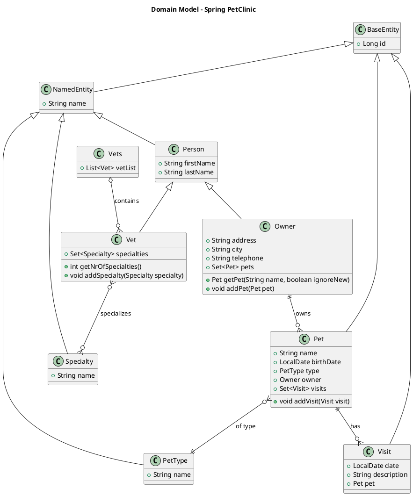

# Spring PetClinic - Comprehensive Project Summary

## Overview

Spring PetClinic is a comprehensive sample application demonstrating Spring Boot best practices for building modern web applications. It showcases a complete veterinary clinic management system with owner, pet, and veterinarian management capabilities, including recent UI/UX enhancements for improved user workflows.

**Technology Stack:**
- **Framework:** Spring Boot 3.4.2
- **Java Version:** 17+
- **Build Tools:** Maven 3.9.9 / Gradle 8.10.2
- **Database:** H2 (default), MySQL 8.0+, PostgreSQL 14+
- **View Technology:** Thymeleaf with Bootstrap 5
- **Testing:** JUnit 5, Testcontainers, MockMvc
- **Caching:** JCache (JSR-107)
- **Containerization:** Docker, Kubernetes

## System Context (C4 - Level 1)

```plantuml
@startuml
!include https://raw.githubusercontent.com/plantuml-stdlib/C4-PlantUML/master/C4_Context.puml

LAYOUT_WITH_LEGEND()

title System Context Diagram - Spring PetClinic

Person(petOwner, "Pet Owner", "Customer who owns pets and schedules visits")
Person(vetStaff, "Veterinary Staff", "Veterinarians and clinic staff managing pets")
Person(clinicAdmin, "Clinic Administrator", "System administrator managing the clinic")

System(petclinic, "Spring PetClinic", "Web application for managing veterinary clinic operations")

System_Ext(database, "Database System", "Stores clinic data (H2/MySQL/PostgreSQL)")
System_Ext(browser, "Web Browser", "User interface for accessing the system")

Rel(petOwner, petclinic, "Manages pets and visits", "HTTPS")
Rel(vetStaff, petclinic, "Views appointments and pet information", "HTTPS")
Rel(clinicAdmin, petclinic, "Administers system configuration", "HTTPS")
Rel(petclinic, database, "Reads/Writes data", "JDBC")
Rel_Back(browser, petclinic, "Serves web pages", "HTTP/HTTPS")

@enduml
```

## Container Diagram (C4 - Level 2)

```plantuml
@startuml
!include https://raw.githubusercontent.com/plantuml-stdlib/C4-PlantUML/master/C4_Container.puml

LAYOUT_WITH_LEGEND()

title Container Diagram - Spring PetClinic

Person(user, "System User", "Pet owners, vets, and administrators")

System_Boundary(petclinic, "Spring PetClinic System") {
    Container(webapp, "Web Application", "Spring Boot", "Serves web pages and REST APIs")
    Container(cache, "Cache Layer", "JCache", "Caches frequently accessed data")
    ContainerDb(database, "Database", "H2/MySQL/PostgreSQL", "Stores all clinic data")
}

System_Ext(browser, "Web Browser", "User's web browser")

Rel(user, browser, "Uses")
Rel(browser, webapp, "Makes requests", "HTTP/HTTPS")
Rel(webapp, cache, "Stores/Retrieves", "In-Memory")
Rel(webapp, database, "Reads/Writes", "JDBC/JPA")

@enduml
```

## Component Diagram (C4 - Level 3)

```plantuml
@startuml
!include https://raw.githubusercontent.com/plantuml-stdlib/C4-PlantUML/master/C4_Component.puml

LAYOUT_WITH_LEGEND()

title Component Diagram - Spring PetClinic Web Application

Container(browser, "Web Browser", "User's browser")

Container_Boundary(webapp, "Spring Boot Web Application") {
    Component(welcomeController, "Welcome Controller", "Spring MVC", "Handles home page and navigation")
    Component(ownerController, "Owner Controller", "Spring MVC", "Manages pet owners")
    Component(petController, "Pet Controller", "Spring MVC", "Manages pets")
    Component(visitController, "Visit Controller", "Spring MVC", "Manages vet visits")
    Component(vetController, "Vet Controller", "Spring MVC", "Manages veterinarians")
    Component(crashController, "Crash Controller", "Spring MVC", "Error handling demonstration")
    
    Component(ownerRepo, "Owner Repository", "Spring Data JPA", "Owner data access")
    Component(vetRepo, "Vet Repository", "Spring Data JPA", "Veterinarian data access")
    
    Component(petValidator, "Pet Validator", "Spring Validation", "Validates pet data")
    Component(petTypeFormatter, "Pet Type Formatter", "Spring Formatter", "Formats pet types")
    
    Component(cacheConfig, "Cache Configuration", "Spring Cache", "Configures JCache")
    Component(webConfig, "Web Configuration", "Spring MVC", "Internationalization setup")
    
    Component(thymeleaf, "Thymeleaf Templates", "Template Engine", "Renders HTML views")
}

ContainerDb(database, "Database", "JPA Entities")

Rel(browser, welcomeController, "GET /")
Rel(browser, ownerController, "CRUD operations on owners")
Rel(browser, petController, "CRUD operations on pets")
Rel(browser, visitController, "CRUD operations on visits")
Rel(browser, vetController, "View veterinarians")
Rel(browser, crashController, "Error scenarios")

Rel(ownerController, ownerRepo, "Uses")
Rel(petController, ownerRepo, "Uses")
Rel(visitController, ownerRepo, "Uses")
Rel(vetController, vetRepo, "Uses")

Rel(petController, petValidator, "Validates")
Rel(petController, petTypeFormatter, "Formats")

Rel(ownerRepo, database, "Persists", "JPA")
Rel(vetRepo, database, "Persists", "JPA")

Rel(welcomeController, thymeleaf, "Renders")
Rel(ownerController, thymeleaf, "Renders")
Rel(petController, thymeleaf, "Renders")
Rel(visitController, thymeleaf, "Renders")
Rel(vetController, thymeleaf, "Renders")

@enduml
```

## Domain Model



## Application Architecture

### 1. **Core Application Structure**
- **Main Class:** `PetClinicApplication.java` - Spring Boot entry point with auto-configuration
- **Base Package:** `org.springframework.samples.petclinic`
- **Architecture Pattern:** MVC with Repository pattern using Spring Data JPA

### 2. **Domain Models**
Located in `src/main/java/org/springframework/samples/petclinic/`:

#### Base Entities (`model/`)
- **BaseEntity:** Abstract base with ID field and JPA annotations
- **NamedEntity:** Extends BaseEntity, adds name field with validation
- **Person:** Abstract person with firstName and lastName

#### Owner Domain (`owner/`)
- **Owner:** Pet owner entity with address, city, telephone, and pet collection
- **Pet:** Pet entity with name, birth date, type, owner, and visits
- **Visit:** Vet visit with date, description, and associated pet
- **PetType:** Enumeration of pet types (Cat, Dog, Lizard, Snake, Bird, Hamster)

#### Veterinarian Domain (`vet/`)
- **Vet:** Veterinarian entity with specialties collection
- **Specialty:** Medical specialties (Cardiology, Dentistry, Nutrition, etc.)
- **Vets:** Wrapper class for vet collections

### 3. **Controller Layer**
All controllers use Spring MVC with Thymeleaf view resolution:

#### Owner Management (`owner/`)
- **OwnerController:** Full CRUD operations for owners
  - `GET /owners` - Search and list owners (paginated)
  - `GET /owners/new` - New owner form
  - `POST /owners/new` - Create owner
  - `GET /owners/{ownerId}` - Owner details
  - `GET /owners/{ownerId}/edit` - Edit owner form
  - `POST /owners/{ownerId}/edit` - Update owner

- **PetController:** Pet management within owner context
  - `GET /owners/{ownerId}/pets/new` - New pet form
  - `POST /owners/{ownerId}/pets/new` - Create pet
  - `GET /owners/{ownerId}/pets/{petId}/edit` - Edit pet form
  - `POST /owners/{ownerId}/pets/{petId}/edit` - Update pet

- **VisitController:** Visit scheduling and management
  - `GET /owners/{ownerId}/pets/{petId}/visits/new` - New visit form
  - `POST /owners/{ownerId}/pets/{petId}/visits/new` - Create visit

#### Veterinarian Management (`vet/`)
- **VetController:** Veterinarian listing with caching
  - `GET /vets` - List all veterinarians (cached)
  - Content negotiation support (HTML, JSON, XML)

#### System Controllers (`system/`)
- **WelcomeController:** Home page (`GET /`)
- **CrashController:** Error handling demonstration (`GET /oups`)

### 4. **Data Access Layer**
Using Spring Data JPA with repository interfaces:

- **OwnerRepository:** Owner and pet data operations with custom queries
  - `findByLastName()` - Search owners by last name
  - `findById()` - Owner details with pets and visits
  - `save()` - Create/update operations

- **VetRepository:** Veterinarian data access
  - `findAll()` - All vets with specialties (cached)

### 5. **Database Configuration**
Multi-database support with profiles:

#### Supported Databases
- **H2** (default): In-memory for development
- **MySQL 8.0+**: Production-ready with Testcontainers
- **PostgreSQL 14+**: Alternative production database

#### Schema Management
- **Tables:** owners, pets, types, specialties, vets, vet_specialties, visits
- **Relationships:** Proper foreign key constraints
- **Data Initialization:** Sample data for all database types

### 6. **Validation and Data Binding**
- **Bean Validation:** JSR-303 annotations (@NotEmpty, @Digits, @DateTimeFormat)
- **Custom Validators:** PetValidator for business logic
- **Formatters:** PetTypeFormatter for dropdown binding
- **Error Handling:** Comprehensive form validation with user-friendly messages

### 7. **Internationalization (i18n)**
Support for 8 languages with complete message bundles:
- English (default), German, Spanish, Persian, Korean, Portuguese, Russian, Turkish
- **Configuration:** WebConfiguration with LocaleChangeInterceptor
- **Message Keys:** Comprehensive coverage for all UI elements

### 8. **Caching Strategy**
- **Technology:** JCache (JSR-107) with Spring Cache abstraction
- **Cached Data:** Veterinarian listings (`vets` cache)
- **Configuration:** CacheConfiguration with cache manager setup

### 9. **View Layer**
- **Template Engine:** Thymeleaf with Spring Security integration
- **Styling:** Bootstrap 5 with custom SCSS compilation
- **Responsive Design:** Mobile-friendly layout
- **Fragments:** Reusable header, footer, and layout components

### 10. **Testing Strategy**

#### Unit Tests
- **Controllers:** MockMvc for web layer testing
- **Repositories:** @DataJpaTest for data layer
- **Services:** @SpringBootTest for integration

#### Integration Tests
- **Database:** Testcontainers for MySQL/PostgreSQL
- **Web:** @SpringBootTest with TestRestTemplate
- **Caching:** Cache behavior validation

#### Test Coverage
- Controller layer: Form handling, validation, error scenarios
- Repository layer: Custom queries, data persistence
- Internationalization: Message resolution for all locales

## API Endpoints

### Owner Management
```
GET    /owners                    # Search owners (paginated)
GET    /owners/find               # Find owner form
GET    /owners/new                # New owner form  
POST   /owners/new                # Create owner
GET    /owners/{ownerId}          # Owner details
GET    /owners/{ownerId}/edit     # Edit owner form
POST   /owners/{ownerId}/edit     # Update owner
```

### Pet Management
```
GET    /owners/{ownerId}/pets/new           # New pet form
POST   /owners/{ownerId}/pets/new           # Create pet
GET    /owners/{ownerId}/pets/{petId}/edit  # Edit pet form
POST   /owners/{ownerId}/pets/{petId}/edit  # Update pet
```

### Visit Management
```
GET    /owners/{ownerId}/pets/{petId}/visits/new  # New visit form
POST   /owners/{ownerId}/pets/{petId}/visits/new  # Create visit
```

### Veterinarian Management
```
GET    /vets         # List veterinarians (HTML)
GET    /vets.json    # List veterinarians (JSON)
GET    /vets.xml     # List veterinarians (XML)
```

### System Endpoints
```
GET    /             # Welcome page
GET    /oups         # Error demonstration
```

## Key Features

### 1. **Owner Management**
- Complete CRUD operations for pet owners
- Search functionality with pagination
- Address and contact information management
- Validation for required fields and data formats

### 2. **Pet Management**
- Pet registration with owner association
- Pet type selection from predefined types
- Birth date tracking with validation
- Pet-specific visit history

### 3. **Visit Scheduling**
- Veterinary visit creation and tracking
- Date and description management
- Association with specific pets
- Visit history per pet
- **Schedule Visit Quick Action** - One-click button on pet cards for rapid visit scheduling

### 4. **Veterinarian Directory**
- Complete veterinarian listings
- Specialty tracking and display
- Cached data for performance
- Multiple output formats (HTML, JSON, XML)

### 5. **Form Validation**
- Server-side validation with Bean Validation
- Custom business logic validation
- User-friendly error messages
- Client-side date pickers and formatters

### 6. **Responsive Design**
- Bootstrap 5 responsive layout
- Mobile-friendly navigation
- Consistent styling across pages
- SCSS-based custom styling

### 7. **Multilingual Support**
- 8 language translations
- Locale-based message resolution
- URL-based locale switching
- Complete UI translation coverage

### 8. **Performance Optimization**
- JCache implementation for vet data
- Database query optimization
- Lazy loading for entity relationships
- Efficient pagination for large datasets

### 9. **UI/UX Enhancements**
- **Schedule Visit Quick Action Button** - Prominent green button with calendar icon on pet cards
- One-click navigation to visit scheduling from owner details page
- Spring-themed visual design with consistent styling
- Internationalization support for button text and tooltips
- Improved workflow reducing navigation steps for common tasks

## Build and Deployment

### Local Development
```bash
# Maven
mvn spring-boot:run

# Gradle  
./gradlew bootRun

# Access application
http://localhost:8080
```

### Database Profiles
```bash
# MySQL
mvn spring-boot:run -Dspring-boot.run.profiles=mysql

# PostgreSQL
mvn spring-boot:run -Dspring-boot.run.profiles=postgres
```

### Docker Deployment
```bash
# Start databases
docker-compose up -d

# Build and run
mvn spring-boot:build-image
docker run -p 8080:8080 spring-petclinic:3.4.2
```

### Kubernetes Deployment
```bash
# Apply configurations
kubectl apply -f k8s/

# Services available:
# - petclinic-service (web app)
# - mysql-service (database)
```

## Database Schema

### Core Tables
- **owners**: Pet owner information (id, first_name, last_name, address, city, telephone)
- **pets**: Pet details (id, name, birth_date, type_id, owner_id)
- **types**: Pet types (id, name) - Cat, Dog, Lizard, Snake, Bird, Hamster
- **visits**: Vet visits (id, pet_id, visit_date, description)
- **vets**: Veterinarian information (id, first_name, last_name)
- **specialties**: Medical specialties (id, name)
- **vet_specialties**: Many-to-many relationship (vet_id, specialty_id)

### Relationships
- **Owner → Pet**: One-to-Many (Owner can have multiple pets)
- **Pet → Visit**: One-to-Many (Pet can have multiple visits)
- **Pet → PetType**: Many-to-One (Pets have one type)
- **Vet → Specialty**: Many-to-Many (Vets can have multiple specialties)

## Monitoring and Observability

### Spring Boot Actuator
- Health checks: `/actuator/health`
- Metrics: `/actuator/metrics`
- Info endpoint: `/actuator/info`
- Environment: `/actuator/env`

### Application Monitoring
- JVM metrics and memory usage
- Database connection health
- Cache statistics
- Custom business metrics

## Security Considerations

### Input Validation
- Bean Validation for all form inputs
- XSS protection through Thymeleaf escaping
- SQL injection prevention via JPA/Hibernate
- CSRF protection (when security enabled)

### Data Protection
- Parameterized queries prevent injection
- Input sanitization and validation
- Error message sanitization
- Secure session management

## Development Best Practices

### Code Organization
- Domain-driven package structure
- Separation of concerns (MVC pattern)
- Interface-based repository design
- Consistent naming conventions

### Testing Approach
- Comprehensive test coverage
- Unit tests for business logic
- Integration tests with real databases
- Web layer testing with MockMvc

### Configuration Management
- Profile-based configuration
- Externalized properties
- Environment-specific settings
- Docker and Kubernetes ready

## Project Structure

### Directory Tree
```
spring-petclinic/
├── gradle/                          # Gradle wrapper
├── k8s/                            # Kubernetes configurations
├── src/
│   ├── checkstyle/                 # Code style configurations
│   ├── main/
│   │   ├── java/org/springframework/samples/petclinic/
│   │   │   ├── model/              # Base entity classes
│   │   │   ├── owner/              # Owner domain (Owner, Pet, Visit)
│   │   │   ├── vet/                # Veterinarian domain
│   │   │   ├── system/             # System configuration
│   │   │   └── PetClinicApplication.java
│   │   ├── resources/
│   │   │   ├── db/                 # Database scripts
│   │   │   ├── messages/           # i18n message bundles
│   │   │   ├── static/             # CSS, JS, images
│   │   │   ├── templates/          # Thymeleaf templates
│   │   │   └── application*.properties
│   │   └── scss/                   # SASS stylesheets
│   └── test/                       # Test suite
│       ├── java/                   # Unit and integration tests
│       └── jmeter/                 # Performance tests
├── docker-compose.yml              # Database containers
├── pom.xml                         # Maven configuration
├── build.gradle                    # Gradle configuration
└── README.md
```

## Technologies Deep Dive

### Spring Framework Components
- **Spring Boot 3.4.2**: Auto-configuration and embedded server
- **Spring MVC**: Web layer with REST controllers
- **Spring Data JPA**: Repository pattern implementation
- **Spring Cache**: Declarative caching abstraction
- **Spring Validation**: Bean validation integration

### Frontend Technologies
- **Thymeleaf**: Server-side template engine
- **Bootstrap 5**: Responsive CSS framework
- **SCSS**: Enhanced CSS with variables and mixins
- **JavaScript**: Form validation and interactivity

### Database Technologies
- **H2**: In-memory database for development
- **MySQL 8.0+**: Production database option
- **PostgreSQL 14+**: Alternative production database
- **Hibernate**: JPA implementation
- **Flyway**: Database migration (implicit via Spring Boot)

### Testing Technologies
- **JUnit 5**: Unit testing framework
- **Testcontainers**: Integration testing with real databases
- **MockMvc**: Web layer testing
- **AssertJ**: Fluent assertion library
- **Hamcrest**: Matcher library for assertions

## Future Enhancements

### Potential Features
- User authentication and authorization
- Appointment scheduling system
- Medical records management
- Payment processing integration
- Email notification system
- Mobile application API
- Advanced reporting and analytics

### Technical Improvements
- Microservices architecture migration
- Event-driven architecture with messaging
- Advanced caching strategies
- Performance monitoring integration
- Automated security scanning
- CI/CD pipeline implementation

## Future Features Roadmap - Implementation Checklist

### 🔐 Authentication & Authorization
- [ ] **User Management System**
  - [ ] User registration and login functionality
  - [ ] Role-based access control (Owner, Veterinarian, Admin, Receptionist)
  - [ ] Password reset and email verification
  - [ ] User profile management
  - [ ] Multi-factor authentication (MFA)

- [ ] **Security Enhancements**
  - [ ] Spring Security integration with JWT tokens
  - [ ] OAuth2 integration (Google, Facebook, GitHub)
  - [ ] Session management and timeout handling
  - [ ] Audit logging for sensitive operations
  - [ ] Rate limiting and API throttling

### 📅 Appointment Management
- [ ] **Scheduling System**
  - [ ] Appointment booking with calendar interface
  - [ ] Veterinarian availability management
  - [ ] Appointment conflicts detection
  - [ ] Recurring appointments support
  - [ ] Appointment cancellation and rescheduling

- [ ] **Notifications**
  - [ ] Email appointment reminders
  - [ ] SMS notifications integration
  - [ ] Push notifications for mobile app
  - [ ] Automated follow-up reminders
  - [ ] Appointment confirmation workflows

### 🏥 Medical Records & Healthcare
- [ ] **Electronic Health Records (EHR)**
  - [ ] Pet medical history timeline
  - [ ] Vaccination tracking and reminders
  - [ ] Prescription management
  - [ ] Laboratory test results storage
  - [ ] Medical image attachments (X-rays, photos)

- [ ] **Treatment Management**
  - [ ] Treatment plans and protocols
  - [ ] Medication dosage tracking
  - [ ] Surgery scheduling and notes
  - [ ] Recovery progress monitoring
  - [ ] Allergies and special conditions tracking

### 💰 Financial Management
- [ ] **Billing & Payments**
  - [ ] Invoice generation and management
  - [ ] Payment processing (Stripe, PayPal integration)
  - [ ] Payment plans and installments
  - [ ] Insurance claims processing
  - [ ] Financial reporting and analytics

- [ ] **Inventory Management**
  - [ ] Medical supplies tracking
  - [ ] Medication inventory management
  - [ ] Automatic reorder points
  - [ ] Supplier management
  - [ ] Cost tracking and analysis

### 📱 Mobile & Communication
- [ ] **Mobile Application**
  - [ ] React Native or Flutter mobile app
  - [ ] Pet owner mobile portal
  - [ ] Veterinarian mobile dashboard
  - [ ] Offline functionality support
  - [ ] Mobile payment integration

- [ ] **Communication Features**
  - [ ] In-app messaging system
  - [ ] Telemedicine video consultations
  - [ ] File sharing capabilities
  - [ ] Emergency contact system
  - [ ] Automated appointment confirmations

### 📊 Analytics & Reporting
- [ ] **Business Intelligence**
  - [ ] Dashboard with key performance indicators
  - [ ] Revenue and financial analytics
  - [ ] Patient demographics analysis
  - [ ] Treatment outcome statistics
  - [ ] Veterinarian performance metrics

- [ ] **Advanced Reporting**
  - [ ] Custom report builder
  - [ ] Scheduled report generation
  - [ ] Export to PDF, Excel, CSV
  - [ ] Regulatory compliance reports
  - [ ] Data visualization with charts and graphs

### 🔧 Technical Enhancements
- [ ] **Performance & Scalability**
  - [ ] Microservices architecture migration
  - [ ] Redis caching implementation
  - [ ] Database sharding and read replicas
  - [ ] CDN integration for static assets
  - [ ] API rate limiting and circuit breakers

- [ ] **DevOps & Infrastructure**
  - [ ] CI/CD pipeline with GitHub Actions
  - [ ] Automated testing and deployment
  - [ ] Container orchestration with Kubernetes
  - [ ] Monitoring with Prometheus and Grafana
  - [ ] Log aggregation with ELK stack

### 🌐 Integration & APIs
- [ ] **Third-Party Integrations**
  - [ ] Laboratory systems integration
  - [ ] Pet insurance providers API
  - [ ] Pharmacy systems connectivity
  - [ ] Government pet registry integration
  - [ ] Social media sharing features

- [ ] **API Development**
  - [ ] RESTful API with OpenAPI documentation
  - [ ] GraphQL endpoint implementation
  - [ ] Webhook support for external systems
  - [ ] API versioning strategy
  - [ ] Developer portal and SDK

### 🧪 Advanced Features
- [ ] **AI & Machine Learning**
  - [ ] Diagnostic assistance with AI
  - [ ] Predictive health analytics
  - [ ] Automated appointment scheduling optimization
  - [ ] Drug interaction checking
  - [ ] Image recognition for medical conditions

- [ ] **Multi-Tenancy**
  - [ ] Support for multiple clinic instances
  - [ ] Tenant isolation and data security
  - [ ] Customizable branding per clinic
  - [ ] Centralized administration portal
  - [ ] Billing and subscription management

### 📋 Compliance & Standards
- [ ] **Regulatory Compliance**
  - [ ] HIPAA compliance for pet health data
  - [ ] GDPR compliance for EU users
  - [ ] Data encryption at rest and in transit
  - [ ] Data backup and disaster recovery
  - [ ] Compliance audit trails

- [ ] **Quality Assurance**
  - [ ] Automated testing coverage >90%
  - [ ] Performance testing and load testing
  - [ ] Security penetration testing
  - [ ] Accessibility compliance (WCAG 2.1)
  - [ ] Cross-browser compatibility testing

### 🎨 User Experience
- [ ] **UI/UX Improvements**
  - [ ] Modern responsive design refresh
  - [ ] Dark mode support
  - [ ] Accessibility improvements
  - [ ] Progressive Web App (PWA) features
  - [ ] Voice interface integration

- [ ] **Customization**
  - [ ] Customizable dashboard layouts
  - [ ] User preference settings
  - [ ] Clinic branding customization
  - [ ] Custom form builder
  - [ ] Workflow automation tools

### 🔄 Data Management
- [ ] **Import/Export Features**
  - [ ] Data migration tools
  - [ ] Bulk data import from CSV/Excel
  - [ ] API-based data synchronization
  - [ ] Legacy system data migration
  - [ ] Cloud backup integration

- [ ] **Advanced Search**
  - [ ] Elasticsearch integration
  - [ ] Full-text search capabilities
  - [ ] Advanced filtering options
  - [ ] Search result ranking
  - [ ] Saved search preferences

### Implementation Priority Levels
- **🔴 High Priority (6-12 months)**
  - Authentication & Authorization
  - Basic Appointment Management
  - Mobile Application MVP
  - Payment Processing

- **🟡 Medium Priority (12-18 months)**
  - Medical Records System
  - Advanced Analytics
  - Third-Party Integrations
  - Performance Optimizations

- **🟢 Low Priority (18+ months)**
  - AI/ML Features
  - Multi-Tenancy Support
  - Advanced Compliance Features
  - Voice Interface Integration

---

**Note:** This roadmap represents potential enhancements to transform the Spring PetClinic from a sample application into a production-ready veterinary management system. Implementation should be prioritized based on business requirements, user feedback, and technical feasibility.

## Quick Wins - Easy First Features to Implement 🚀

### 🎯 **Beginner-Friendly Enhancements (1-3 days each)**

- [ ] **Search & Filtering Improvements**
  - [ ] Add owner search by city filter on owners list page
  - [ ] Add pet type filter dropdown on owners search
  - [ ] Add veterinarian search by specialty filter
  - [ ] Add date range filter for visits (last week, month, year)
  - [ ] Add "Clear Filters" button to reset search criteria

- [ ] **UI/UX Quick Improvements**
  - [ ] Add "Add New Pet" button directly on owner detail page
  - [ ] Add "Schedule Visit" quick action button on pet cards
  - [ ] Add breadcrumb navigation (Home > Owners > John Doe > Pets)
  - [ ] Add confirmation dialogs for delete operations
  - [ ] Add success/error toast notifications for form submissions

- [ ] **Data Display Enhancements**
  - [ ] Add pet age calculation and display (from birth date)
  - [ ] Add visit count badge on pet cards
  - [ ] Add "Last Visit" date display on pet information
  - [ ] Sort veterinarians by name or specialty count
  - [ ] Add owner's total pets count on owner cards

- [ ] **Form Improvements**
  - [ ] Add input field validation feedback (real-time)
  - [ ] Add placeholder text to form fields
  - [ ] Add character counter for description fields
  - [ ] Pre-populate current date in visit form
  - [ ] Add "Copy from previous visit" feature

- [ ] **Navigation & Accessibility**
  - [ ] Add "Back to Owner" button on pet/visit forms
  - [ ] Add keyboard shortcuts (Ctrl+N for new, Ctrl+S for save)
  - [ ] Add focus management for better accessibility
  - [ ] Add loading indicators for form submissions
  - [ ] Add "Recently Viewed" section on homepage

- [ ] **Data Validation & Quality**
  - [ ] Add email format validation for future contact fields
  - [ ] Add phone number format validation
  - [ ] Prevent duplicate pet names for same owner
  - [ ] Add maximum birth date validation (not in future)
  - [ ] Add minimum visit date validation (not too far in past)

- [ ] **Export & Reporting**
  - [ ] Add "Print Owner Details" button with CSS print styles
  - [ ] Add "Export Pets List" as CSV functionality
  - [ ] Add "Export Visit History" for individual pets
  - [ ] Add simple visit statistics on owner page (total visits, last visit)
  - [ ] Add veterinarian workload display (number of visits)

- [ ] **Performance & Caching**
  - [ ] Add pagination controls to owners list (First, Previous, Next, Last)
  - [ ] Add page size selector (10, 25, 50 items per page)
  - [ ] Cache pet types dropdown data
  - [ ] Add lazy loading for visit history on large pet records
  - [ ] Optimize database queries with proper indexes

### 🛠️ **Implementation Tips for Beginners**

**Start with these easiest ones:**
1. **Pet age calculation** - Simple date arithmetic in Thymeleaf templates
2. **Breadcrumb navigation** - HTML/CSS addition to existing templates
3. **Form placeholders** - Just adding `placeholder` attributes to inputs
4. **Success notifications** - Add Bootstrap alerts after form submissions
5. **"Add New Pet" button** - Simple link addition to owner detail page

**Recommended Learning Path:**
- **Week 1**: UI improvements (buttons, placeholders, breadcrumbs)
- **Week 2**: Simple filtering (city, pet type filters)
- **Week 3**: Form enhancements (validation feedback, date calculations)
- **Week 4**: Export features (print styles, CSV export)

**Required Skills:**
- ✅ Basic HTML/CSS
- ✅ Thymeleaf template syntax
- ✅ Spring MVC controller methods
- ✅ Bootstrap CSS framework
- ⚡ Basic JavaScript (for interactive features)
- ⚡ Spring Data JPA queries (for filtering)

**Files You'll Mainly Work With:**
- `src/main/resources/templates/**/*.html` (UI changes)
- `src/main/java/**/controller/*.java` (controller logic)
- `src/main/java/**/repository/*.java` (database queries)
- `src/main/resources/static/resources/css/*.css` (styling)
- `src/main/resources/messages/*.properties` (text labels)

## Recent Implementations (2024)

### ✅ **Schedule Visit Quick Action Button** (May 2024)

**Feature Description:**
Added a prominent "Schedule Visit" quick action button on each pet card in the owner details page to streamline the visit scheduling workflow.

**Implementation Details:**
- **Files Modified:**
  - `ownerDetails.html` - Added Schedule Visit button with Spring theme styling
  - `messages.properties` - Added internationalization support for button text and tooltip
- **Technical Features:**
  - Green Spring-themed button (`#6db33f`) with calendar icon
  - Bootstrap responsive design with proper styling
  - Internationalization support for multiple languages
  - Direct integration with existing visit creation endpoint
  - User-friendly tooltip for accessibility
- **User Experience:**
  - Reduces navigation steps from 3+ clicks to 1 click
  - Intuitive visual design with calendar icon
  - Consistent with application's design language
  - Improved workflow for clinic staff scheduling appointments

**Files:**
```
src/main/resources/templates/owners/ownerDetails.html (lines 79-86)
src/main/resources/messages/messages.properties (scheduleVisit, scheduleVisitTooltip)
```

**Testing:**
- ✅ Application startup successful
- ✅ Template rendering without errors
- ✅ Button navigation to visit creation form
- ✅ Internationalization working correctly
- ✅ Clean application logs with no exceptions

---
