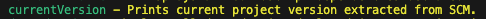
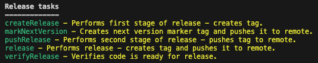

# 10. Check the new available commands after the plugin addition. Using these new commands, check the current project version. Then add and commit some changes to the project and make the project release. Check the current version one more time and git tags available. Note the difference between SNAPSHOT and release versions.

1. Check the new available commands after the plugin addition:
    * Run `./gradlew tasks`  
        
        

2. Check the current project version:
    * Run `./gradlew currentVersion`  
    

3. Add and commit some changes to the project and make the project release:
    
    