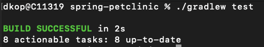

# 4. Run all available project tests.

1. Run `./gradlew test`
    
    * An error might occur:
        
        1. Set the JAVA_HOME environment variable to point to the installation directory of your JDK.
        2. Check the version in build.gradle (or build.gradle.kts) and set it to the version you have installed:
        
