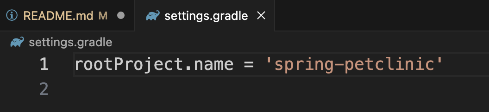
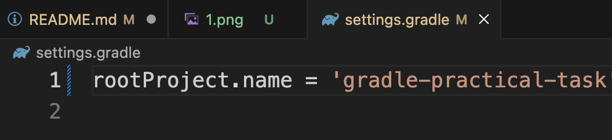

# 7. Explore gradle-related files. Identify which gradle file defines the project name and change it. Build the project again and verify the new project name is being used (you need to find jar files).

## 1. Change project name:

1. Open the `settings.gradle` file
2. Find the `rootProject.name` field
    
3. Change the value
    

## 2. Build the project again and verify the new project name is being used:

1. Run `./gradlew build`
2. Check the jar files:
    