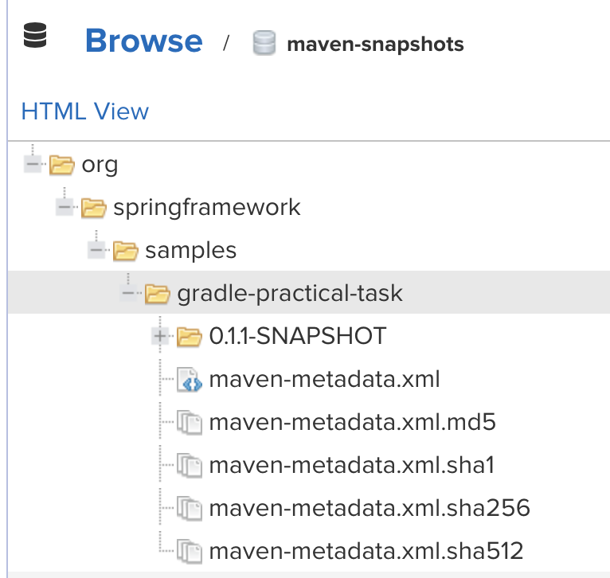

# Nexus Practical Task

This practical task is a part of the `Module 10: Artifact Management: Nexus` of the `Internship: DevOps` course.

This project is forked from: https://github.com/spring-projects/spring-petclinic. 

## Tasks

### 1. Install Nexus
* Go to: https://help.sonatype.com/en/download.html
* Download the latest version for your OS
* Unzip the downloaded file in a desired folder
* `cd nexus-[version]/bin`
* Run: `./nexus start`

### 2. Configure admin user
* Open your browser and go to: `http://localhost:8081/#admin/repository`
* The default login:
  * Username: admin
  * Password: in file `sonatype-work/nexus3/admin.password`
* Create new password

### 3. Configure proxy repo
    1. For Maven: Create setting.xml, maven should use it as mirror
    2. For Gradle: Define proxy repo in gradle settings
* Go to `Admin Settings -> Repositories -> Create repository`
* Select `Maven 2 (proxy)`
* Set Up:
  * Remote storage: `https://repo.maven.apache.org/maven`
* Update `build.gradle` (check the commit)

### 4. Upload spring-petclinic Artifact to Nexus
    1. For Maven: Use the deploy plugin in your pom.xml. You should be able to upload your artifacts to Nexus using Maven.
    2. For Gradle: Define artifact upload as a separate Gradle task
* Update `build.gradle` (check the commit)
* Run `./gradlew uploadArtifact`

### 5. Search artifacts in Nexus
* Go to: `http://localhost:8081/#browse/browse:maven-snapshots`
