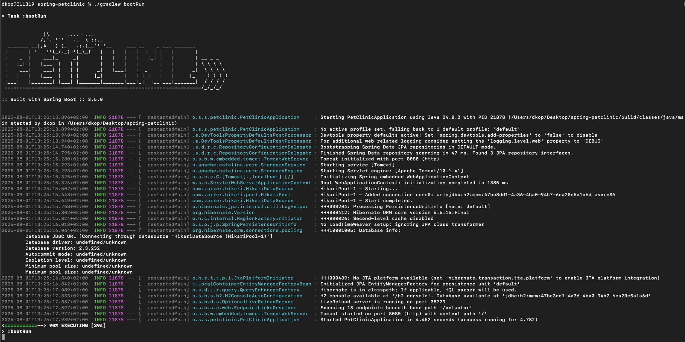
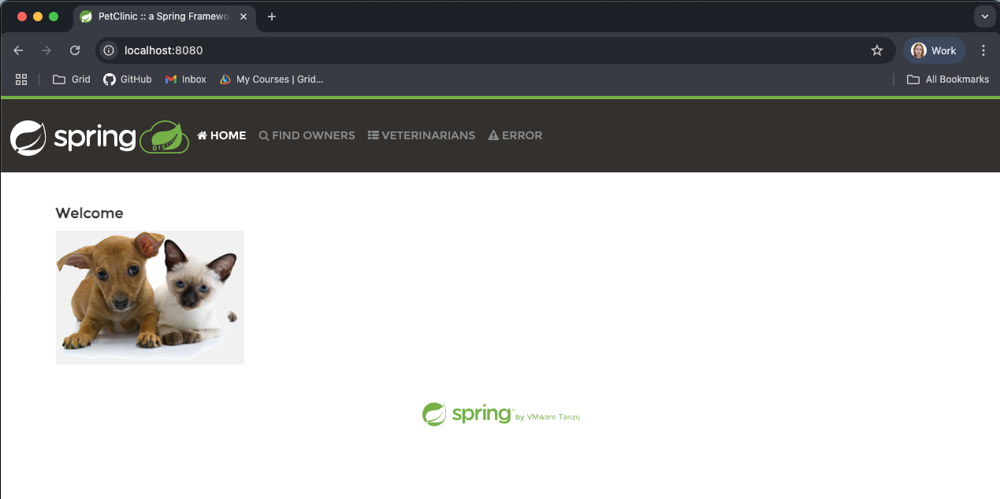

# 5. Build the project and run it, and verify it's available on the localhost in the browser.

1. Run `./gradlew build`
    
2. Run `./gradlew bootRun`
    
3. Open the browser at `http://localhost:8080`
    