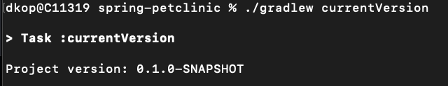

# 9. Add the dynamic versioning to your project using the commonly used axion-release-plugin

1. Add `id 'pl.allegro.tech.build.axion-release' version '1.15.2'` to plugins in the `build.gradle` file:
    

2. Write `project.version = scmVersion.version` instead od `version='...'`

3. To check the current version, run `./gradlew currentVersion`
    