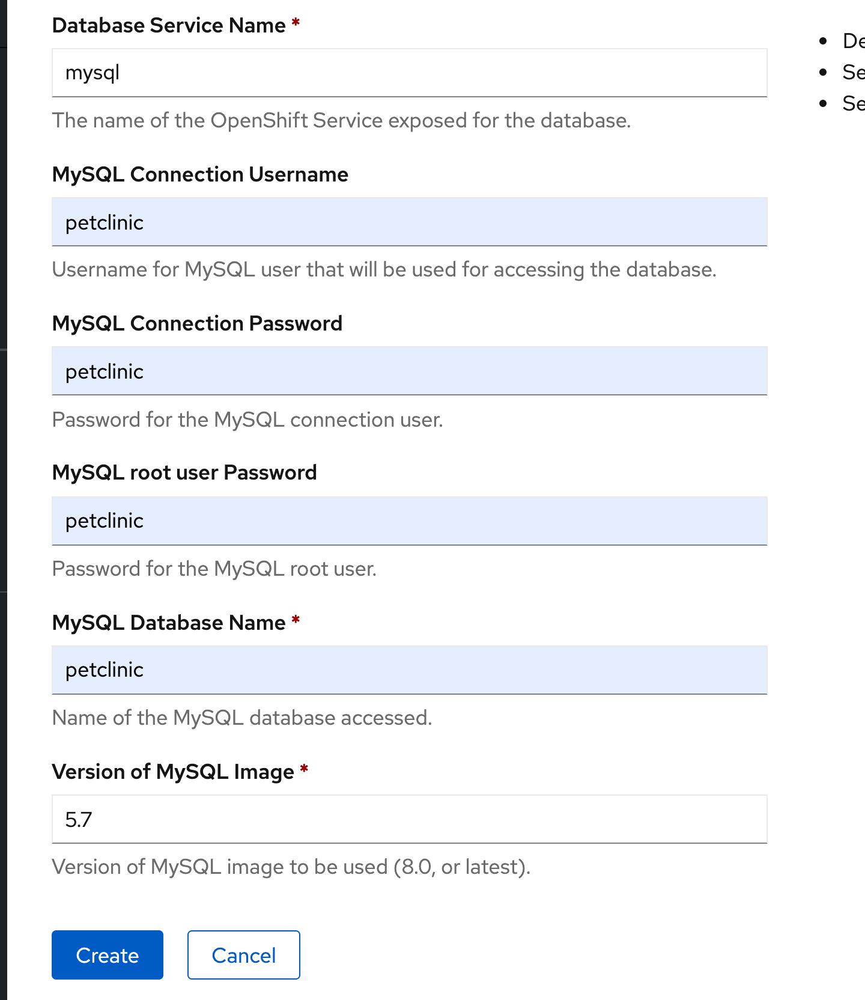

```
mvn package

docker-compose up

java -Dspring.profiles.active=mysql -jar target/spring-petclinic-2.3.0.BUILD-SNAPSHOT.jar 

docker exec -it spring-petclinic_mysql_1 mysql -upetclinic -ppetclinic

show databases;
use petclinic;
show tables;

+---------------------+
| Tables_in_petclinic |
+---------------------+
| owners              |
| pets                |
| specialties         |
| types               |
| vet_specialties     |
| vets                |
| visits              |
+---------------------+
7 rows in set (0.00 sec)

select * from petclinic.owners;
+----+------------+-----------+-----------------------+-------------+------------+
| id | first_name | last_name | address               | city        | telephone  |
+----+------------+-----------+-----------------------+-------------+------------+
|  1 | George     | Franklin  | 110 W. Liberty St.    | Madison     | 6085551023 |
|  2 | Betty      | Davis     | 638 Cardinal Ave.     | Sun Prairie | 6085551749 |
|  3 | Eduardo    | Rodriquez | 2693 Commerce St.     | McFarland   | 6085558763 |
|  4 | Harold     | Davis     | 563 Friendly St.      | Windsor     | 6085553198 |
|  5 | Peter      | McTavish  | 2387 S. Fair Way      | Madison     | 6085552765 |
|  6 | Jean       | Coleman   | 105 N. Lake St.       | Monona      | 6085552654 |
|  7 | Jeff       | Black     | 1450 Oak Blvd.        | Monona      | 6085555387 |
|  8 | Maria      | Escobito  | 345 Maple St.         | Madison     | 6085557683 |
|  9 | David      | Schroeder | 2749 Blackhawk Trail  | Madison     | 6085559435 |
| 10 | Carlos     | Estaban   | 2335 Independence La. | Waunakee    | 6085555487 |
| 11 | Burr       | Sutter    | 123 ABC Lane          | Wonderland  | 5555555555 |
| 12 | test       | test      | test                  | test        | 1231231321 |
+----+------------+-----------+-----------------------+-------------+------------+
12 rows in set (0.00 sec)


http://localhost:8080

```


For OpenShift



Edit the DeploymentConfig for the application pod


