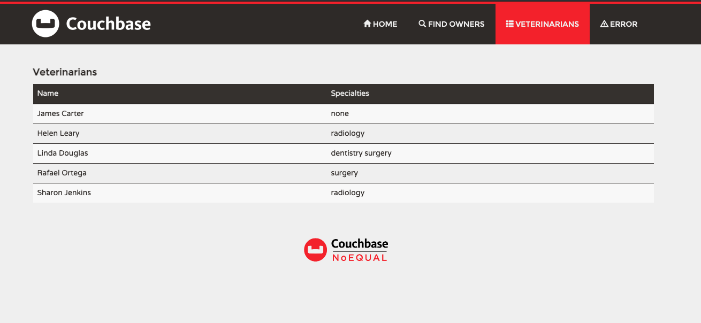

# Couchbase Spring PetClinic Sample Application [](https://travis-ci.org/spring-projects/spring-petclinic/)

Couchbase Spring PetClinic is a fork from the original Spring Pet Clinic adapted to work with Couchbase.

## Running PetClinic on GitPod
To run this app on GitPod simply click [here](https://gitpod.io/#https://github.com/deniswsrosa/couchbase-spring-petclinic.git)

## Running petclinic locally
Petclinic is a [Spring Boot](https://spring.io/guides/gs/spring-boot) application built using [Maven](https://spring.io/guides/gs/maven/). You can build a jar file and run it from the command line:


```
git clone https://github.com/deniswsrosa/couchbase-spring-petclinic
cd spring-petclinic
./mvnw package
java -jar target/*.jar
```

You can then access petclinic here: http://localhost:8080/



Or you can run it from Maven directly using the Spring Boot Maven plugin. If you do this it will pick up changes that you make in the project immediately (changes to Java source files require a compile as well - most people use an IDE for this):

```
./mvnw spring-boot:run
```

## In case you find a bug/suggested improvement for Spring Petclinic
Our issue tracker is available here: https://github.com/deniswsrosa/couchbase-spring-petclinic/issues


## Database configuration

The class *CouchbaseConfig* is where you can configure your Couchbase connection. By default it will connect to a bucket called *default* on localhost using the  "Administrator" username and "password" as a password.

## Working with PetClinic in your IDE

### Prerequisites
The following items should be installed in your system:
* Java 8 or newer.
* git command line tool (https://help.github.com/articles/set-up-git)
* Your preferred IDE 
  * Eclipse with the m2e plugin. Note: when m2e is available, there is an m2 icon in `Help -> About` dialog. If m2e is
  not there, just follow the install process here: https://www.eclipse.org/m2e/
  * [Spring Tools Suite](https://spring.io/tools) (STS)
  * IntelliJ IDEA
  * [VS Code](https://code.visualstudio.com)

### Steps:

1) On the command line
    ```
    git clone https://github.com/deniswsrosa/couchbase-spring-petclinic
    ```
2) Inside Eclipse or STS
    ```
    File -> Import -> Maven -> Existing Maven project
    ```

    Then either build on the command line `./mvnw generate-resources` or using the Eclipse launcher (right click on project and `Run As -> Maven install`) to generate the css. Run the application main method by right clicking on it and choosing `Run As -> Java Application`.

3) Inside IntelliJ IDEA
    In the main menu, choose `File -> Open` and select the Petclinic [pom.xml](pom.xml). Click on the `Open` button.

    CSS files are generated from the Maven build. You can either build them on the command line `./mvnw generate-resources` or right click on the `spring-petclinic` project then `Maven -> Generates sources and Update Folders`.

    A run configuration named `PetClinicApplication` should have been created for you if you're using a recent Ultimate version. Otherwise, run the application by right clicking on the `PetClinicApplication` main class and choosing `Run 'PetClinicApplication'`.

4) Navigate to Petclinic

    Visit [http://localhost:8080](http://localhost:8080) in your browser.


## Looking for something in particular?

|Spring Boot Configuration | Class or Java property files  |
|--------------------------|---|
|The Main Class | [PetClinicApplication](https://github.com/spring-projects/spring-petclinic/blob/main/src/main/java/org/springframework/samples/petclinic/PetClinicApplication.java) |
|Caching | [CacheConfiguration](https://github.com/spring-projects/spring-petclinic/blob/main/src/main/java/org/springframework/samples/petclinic/system/CacheConfiguration.java) |
|Couchbase Configuration | [CouchbaseConfig](https://github.com/deniswsrosa/couchbase-spring-petclinic/blob/main/src/main/java/org/springframework/samples/petclinic/config/CouchbaseConfig.java) |


## Interesting Spring Petclinic branches and forks

The Spring Petclinic "main" branch in the [spring-projects](https://github.com/spring-projects/spring-petclinic)
GitHub org is the "canonical" implementation, currently based on Spring Boot and Thymeleaf. There are
[quite a few forks](https://spring-petclinic.github.io/docs/forks.html) in a special GitHub org
[spring-petclinic](https://github.com/spring-petclinic). If you have a special interest in a different technology stack
that could be used to implement the Pet Clinic then please join the community there.


# Contributing

The [issue tracker](https://github.com/deniswsrosa/couchbase-spring-petclinic/issues) is the preferred channel for bug reports, features requests and submitting pull requests.

For pull requests, editor preferences are available in the [editor config](.editorconfig) for easy use in common text editors. Read more and download plugins at <https://editorconfig.org>. If you have not previously done so, please fill out and submit the [Contributor License Agreement](https://cla.pivotal.io/sign/spring).

# License

The Spring PetClinic sample application is released under version 2.0 of the [Apache License](https://www.apache.org/licenses/LICENSE-2.0).

